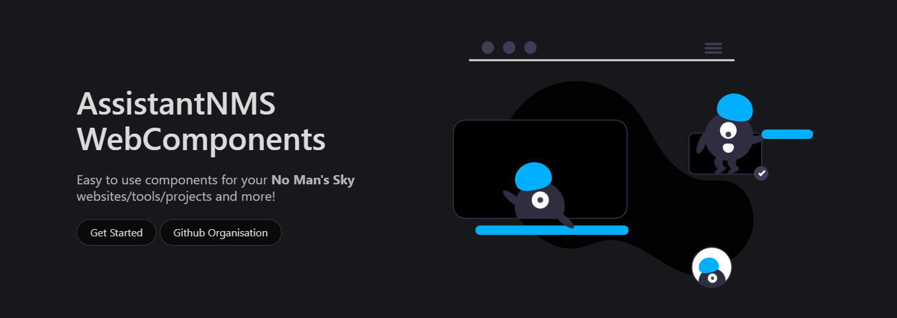

  
  
  
  
   
  [][nmscd] 
  

  [][assistantnmsTwitter]
  [][discord]
  
    

The **Assistant for No Man's Sky** is an app that gives users information about the game, such as crafting recipes, refiner recipes, item costs, blueprint costs, a portal library and guides. Almost all of the data is extracted from the **No Man's Sky** game files. This project would not be possible without the hard work of the NMS Modding community and the [MBinCompiler][mbincompiler].

 

## 🔗 Links
[][assistantnmsWebsite]  
[][assistantnmsWebapp]

[][googlePlayStore]  
[][appleAppStore]

[][assistantnmsTwitter]  
[][discord]  
[][assistantnmsFacebook]  
[][assistantnmsSteamComm]

<!-- Links used in the page -->

[kurtGithub]: https://github.com/Khaoz-Topsy?ref=AssistantNMSGithub
[assistantAppsTools]: https://tools.assistantapps.com?ref=AssistantNMSGithub
[assistantnmsWebsite]: https://nmsassistant.com?ref=AssistantNMSGithub
[assistantnmsWebapp]: https://app.nmsassistant.com?ref=AssistantNMSGithub
[assistantnmsTwitter]: https://twitter.com/AssistantNMS?ref=AssistantNMSGithub
[assistantnmsFacebook]: https://facebook.com/AssistantNMS?ref=AssistantNMSGithub
[assistantnmsSteamComm]: https://steamcommunity.com/groups/AssistantNMS?ref=AssistantNMSGithub
[googlePlayStore]: https://play.google.com/store/apps/details?id=com.kurtlourens.no_mans_sky_recipes&ref=AssistantNMSGithub
[appleAppStore]: https://apps.apple.com/us/app/assistant-for-no-mans-sky/id1480287625?ref=AssistantNMSGithub
[windowsStore]: https://apps.microsoft.com/store/detail/assistant-for-no-mans-sky/9NQLF7XD0LF3?ref=AssistantNMSGithub
[discord]: https://assistantapps.com/discord?ref=AssistantNMSGithub
[nmscd]: https://github.com/NMSCD?ref=AssistantNMSGithub

<!-- Other -->
[mbincompiler]: https://github.com/monkeyman192/MBINCompiler
[flutter]: https://docs.flutter.dev/get-started/install
[androidStudio]: https://developer.android.com/studio
[codeMagic]: https://codemagic.io

